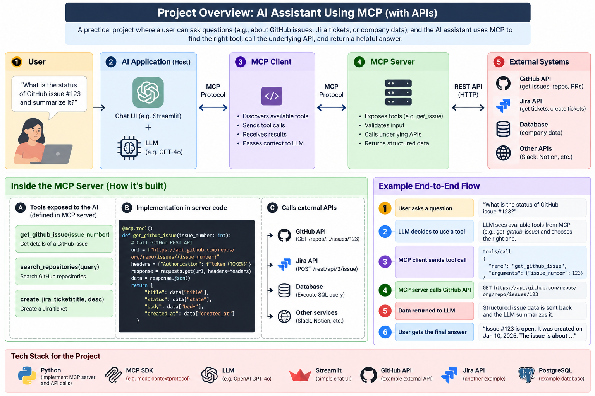

# MCP API Assistant

A practical, learning-focused project demonstrating how the **Model Context Protocol (MCP)** connects AI applications to external tools and APIs.

The project is being built incrementally to show, in a clear and interview-ready way, how an AI application can discover MCP tools, call them through an MCP server, and retrieve real data from an external service such as the GitHub REST API.

The long-term goal is to build a complete AI assistant with this flow:

```text
User
  ↓
Chat Interface
  ↓
LLM / AI Application
  ↓
MCP Client
  ↓
MCP Server
  ↓
External APIs / Databases / Services
```

At the current stage, the project already has a working MCP server connected to the GitHub REST API.

---

## Architecture



The target architecture is:

```text
┌─────────────────────────────┐
│            User             │
│                             │
│ "What is the status of      │
│ GitHub issue #123?"         │
└──────────────┬──────────────┘
               │
               ▼
┌─────────────────────────────┐
│      AI Application         │
│                             │
│ Chat UI + LLM               │
│                             │
│ Future: Streamlit + LLM     │
└──────────────┬──────────────┘
               │
               ▼
┌─────────────────────────────┐
│        MCP Client           │
│                             │
│ - Discovers tools           │
│ - Sends tool calls          │
│ - Receives results          │
└──────────────┬──────────────┘
               │
               │ Model Context Protocol
               ▼
┌─────────────────────────────┐
│        MCP Server           │
│                             │
│ - Exposes tools             │
│ - Validates inputs          │
│ - Calls backend services    │
│ - Returns structured data   │
└──────────────┬──────────────┘
               │
               │ HTTP / REST
               ▼
┌─────────────────────────────┐
│      External Systems       │
│                             │
│ - GitHub REST API           │
│ - Future: Jira API          │
│ - Future: PostgreSQL        │
│ - Future: Other services    │
└─────────────────────────────┘
```

---

## Current Working Architecture

The implemented portion currently looks like this:

```text
MCP Inspector
     │
     │ MCP
     │ tools/list
     │ tools/call
     ▼
MCP Server
     │
     │ Python
     ▼
github_client.py
     │
     │ HTTP GET
     ▼
GitHub REST API
     │
     │ JSON
     ▼
Structured MCP Response
```

The MCP Inspector is currently being used as the development client while the real AI client and LLM layer are built later.

---

## What This Project Demonstrates

This project is designed to demonstrate the practical relationship between:

* Model Context Protocol
* MCP clients
* MCP servers
* Tool discovery
* Tool calling
* REST APIs
* Python application design
* Structured responses
* Error handling
* LLM tool integration
* AI agent architecture
* Git and GitHub workflows

One of the main learning goals is understanding that:

```text
MCP does not replace APIs.
```

Instead, MCP often sits above existing APIs.

For example:

```text
MCP Client
     │
     │ MCP
     ▼
MCP Server
     │
     │ REST API
     ▼
GitHub API
```

The MCP server gives AI applications a standardized interface, while the GitHub REST API remains the backend service interface.

---

# Project Status

## Phase 1: MCP Foundation

Completed:

* [x] Initialize Git repository
* [x] Create Python virtual environment
* [x] Install MCP SDK
* [x] Create MCP server
* [x] Create first MCP tool
* [x] Start MCP Inspector
* [x] Connect MCP Inspector to MCP server
* [x] Verify `tools/list`
* [x] Verify `tools/call`
* [x] Return structured MCP results
* [x] Push first working version to GitHub

The first test tool was:

```text
get_demo_issue(issue_number)
```

It returned mock issue data so the MCP workflow could be tested before introducing an external API.

---

## Phase 2: GitHub REST API Integration

Completed:

* [x] Add Python package configuration
* [x] Add HTTPX
* [x] Create GitHub API client
* [x] Connect to GitHub REST API
* [x] Create a real GitHub issue for testing
* [x] Retrieve issue data directly using Python
* [x] Expose GitHub retrieval through an MCP tool
* [x] Test successful GitHub issue retrieval
* [x] Test invalid issue handling
* [x] Add architecture documentation

Current MCP tool:

```text
get_github_issue(
    owner,
    repo,
    issue_number
)
```

Example:

```text
get_github_issue(
    owner="Padmore-Nana-Prempeh",
    repo="mcp-api-assistant",
    issue_number=1
)
```

The tool retrieves real issue information from GitHub.

---

## Future Phases

Planned:

* [ ] Add additional GitHub MCP tools
* [ ] Add repository search
* [ ] Add issue listing
* [ ] Add pull request support
* [ ] Build dedicated MCP client
* [ ] Integrate an LLM
* [ ] Add automatic tool selection
* [ ] Build Streamlit chat interface
* [ ] Add automated tests
* [ ] Add configuration management
* [ ] Add environment-variable support
* [ ] Add authenticated GitHub access
* [ ] Add Docker support
* [ ] Add observability and logging
* [ ] Add Jira integration
* [ ] Add PostgreSQL integration
* [ ] Add production-ready documentation

---

# Project Structure

Current structure:

```text
mcp-api-assistant/
│
├── docs/
│   └── architecture/
│       └── mcp-system-architecture.png
│
├── src/
│   └── mcp_api_assistant/
│       ├── __init__.py
│       ├── server.py
│       └── github_client.py
│
├── .gitignore
├── pyproject.toml
└── README.md
```

Expected later structure:

```text
mcp-api-assistant/
│
├── app/
│   └── streamlit_app.py
│
├── client/
│   └── agent.py
│
├── docs/
│   └── architecture/
│       └── mcp-system-architecture.png
│
├── src/
│   └── mcp_api_assistant/
│       ├── __init__.py
│       ├── server.py
│       ├── github_client.py
│       ├── config.py
│       │
│       └── tools/
│           ├── issues.py
│           ├── repositories.py
│           └── pull_requests.py
│
├── tests/
│
├── Dockerfile
├── .env.example
├── .gitignore
├── pyproject.toml
└── README.md
```

---

# MCP Server

The MCP server is implemented in:

```text
src/mcp_api_assistant/server.py
```

The server is created using:

```python
from mcp.server import MCPServer

mcp = MCPServer("MCP API Assistant")
```

MCP tools are exposed using:

```python
@mcp.tool()
```

For example:

```python
@mcp.tool()
def get_github_issue(
    owner: str,
    repo: str,
    issue_number: int,
) -> dict:
    ...
```

The decorator tells the MCP server to expose the Python function as a discoverable MCP tool.

---

# GitHub API Layer

The GitHub API integration lives in:

```text
src/mcp_api_assistant/github_client.py
```

This file is intentionally separate from the MCP server.

Its responsibility is:

```text
Construct GitHub API URL
        ↓
Send HTTP request
        ↓
Receive JSON response
        ↓
Handle API errors
        ↓
Return clean Python dictionary
```

The MCP server then calls this API layer.

This separation keeps the architecture clean:

```text
server.py
   │
   │ MCP responsibility
   ▼
MCP


github_client.py
   │
   │ GitHub API responsibility
   ▼
GitHub REST API
```

---

# Current GitHub Tool

The current tool retrieves an individual GitHub issue.

Conceptually:

```text
MCP Client
     │
     │ tools/call
     ▼
get_github_issue()
     │
     ▼
get_issue()
     │
     ▼
GET /repos/{owner}/{repo}/issues/{issue_number}
     │
     ▼
GitHub REST API
```

The GitHub API returns JSON similar to:

```json
{
  "number": 1,
  "title": "Test MCP GitHub API integration",
  "state": "open",
  "body": "This issue is used to test the GitHub REST API integration for the MCP project."
}
```

The application converts it into a cleaner result:

```json
{
  "issue_number": 1,
  "title": "Test MCP GitHub API integration",
  "state": "open",
  "body": "This issue is used to test the GitHub REST API integration for the MCP project.",
  "author": "Padmore-Nana-Prempeh",
  "labels": [],
  "comments": 0,
  "url": "https://github.com/Padmore-Nana-Prempeh/mcp-api-assistant/issues/1",
  "is_pull_request": false
}
```

---

# Error Handling

The GitHub client handles API failures and converts them into readable MCP responses.

For example, requesting:

```text
issue_number = 9999
```

returns something similar to:

```json
{
  "error": "Issue #9999 was not found in Padmore-Nana-Prempeh/mcp-api-assistant.",
  "owner": "Padmore-Nana-Prempeh",
  "repo": "mcp-api-assistant",
  "issue_number": 9999
}
```

This prevents raw HTTP errors from being exposed directly to the future AI application.

---

# Running the Project

## 1. Clone the repository

```bash
git clone https://github.com/Padmore-Nana-Prempeh/mcp-api-assistant.git
```

Move into the project:

```bash
cd mcp-api-assistant
```

---

## 2. Create a virtual environment

```bash
python3 -m venv .venv
```

Activate it:

```bash
source .venv/bin/activate
```

---

## 3. Install the project

```bash
pip install --upgrade pip
pip install -e .
```

---

## 4. Run the MCP server with Inspector

```bash
mcp dev src/mcp_api_assistant/server.py
```

The MCP Inspector should open in the browser.

Connect to the server if necessary.

---

## 5. Open the Tools tab

You should see:

```text
get_github_issue
```

Example input:

```text
owner:
Padmore-Nana-Prempeh

repo:
mcp-api-assistant

issue_number:
1
```

Run the tool.

The MCP server should retrieve the real GitHub issue through the GitHub REST API.

---

# MCP Request Flow

A complete tool request currently looks like this:

```text
1. MCP Inspector requests tool list

MCP Inspector
      │
      │ tools/list
      ▼
MCP Server


2. MCP Server advertises available tools

MCP Server
      │
      ▼
get_github_issue


3. Client invokes tool

MCP Inspector
      │
      │ tools/call
      ▼
MCP Server


4. MCP tool calls Python API layer

MCP Server
      │
      ▼
github_client.py


5. Python calls GitHub REST API

github_client.py
      │
      │ HTTP GET
      ▼
GitHub REST API


6. GitHub returns JSON

GitHub REST API
      │
      ▼
github_client.py


7. MCP server returns structured result

github_client.py
      │
      ▼
MCP Server
      │
      ▼
MCP Inspector
```

---

# MCP vs API

This project intentionally separates these two ideas.

## REST API

A REST API allows software to communicate with a service.

Example:

```text
GET /repos/Padmore-Nana-Prempeh/mcp-api-assistant/issues/1
```

The caller needs to understand:

* endpoint
* HTTP method
* headers
* authentication
* request format
* response format
* error codes

---

## MCP

MCP exposes higher-level capabilities to AI applications.

Example:

```text
get_github_issue(
    owner,
    repo,
    issue_number
)
```

The AI-facing application does not need to know the GitHub REST endpoint.

The MCP server handles that implementation detail.

Conceptually:

```text
AI Application
      │
      │ MCP
      ▼
MCP Server
      │
      │ REST API
      ▼
GitHub
```

---

# Why MCP Matters

Without MCP, an AI application might require custom integration code for every external system:

```text
AI Application
   ├── custom GitHub integration
   ├── custom Jira integration
   ├── custom database integration
   └── custom Slack integration
```

With MCP:

```text
AI Application
       │
       │ MCP
       ▼
┌──────────────┬──────────────┬──────────────┐
│ GitHub MCP   │ Jira MCP     │ Database MCP │
│ Server       │ Server       │ Server       │
└──────────────┴──────────────┴──────────────┘
```

The AI application uses a standardized protocol while each MCP server handles its underlying system.

---

# Tool Discovery

One of the important MCP concepts demonstrated in this project is tool discovery.

The client can request:

```text
tools/list
```

The MCP server responds with the tools it exposes.

For example:

```text
get_github_issue
```

The server also communicates the expected input schema.

Conceptually:

```text
MCP Client

"What tools do you have?"

        ↓

MCP Server

"I expose:

get_github_issue(
    owner: string,
    repo: string,
    issue_number: integer
)"
```

This is important for future LLM integration because the model can inspect the available capabilities and decide which tool to use.

---

# Transport

During development, the MCP Inspector communicates with the Python MCP server using:

```text
stdio
```

Conceptually:

```text
MCP Inspector
      │
      │ Standard Input / Output
      ▼
Python MCP Server
```

Later, a remote deployment may use an HTTP-based MCP transport.

---

# Future AI Flow

Once the LLM layer is added, the intended flow will be:

```text
User:
"What is happening with issue #1?"

            ↓

LLM sees available MCP tools

            ↓

LLM chooses:

get_github_issue(
    owner="Padmore-Nana-Prempeh",
    repo="mcp-api-assistant",
    issue_number=1
)

            ↓

MCP Client

            ↓

MCP Server

            ↓

GitHub REST API

            ↓

Structured issue data

            ↓

LLM

            ↓

User receives a natural-language answer
```

This will demonstrate the full relationship between:

```text
User
→ LLM
→ Tool selection
→ MCP
→ API
→ Structured data
→ LLM reasoning
→ Final answer
```

---

# Tech Stack

Current:

* Python
* Model Context Protocol
* MCP Python SDK
* HTTPX
* GitHub REST API
* MCP Inspector
* Git
* GitHub

Planned:

* LLM integration
* Streamlit
* Docker
* Pytest
* Environment-based configuration
* Additional APIs
* PostgreSQL
* Logging and observability

---

# Development Philosophy

This project is being built incrementally.

Each phase should:

1. introduce one important concept
2. work independently
3. be tested before adding complexity
4. be committed to Git
5. be pushed to GitHub
6. be documented before moving forward

The goal is not only to build a working application.

The goal is to understand every major component well enough to explain the architecture clearly in a technical interview.

---

# Interview Mental Model

A concise way to explain this project is:

```text
I built a Python MCP server that exposes structured tools to AI clients.

The MCP server currently exposes a get_github_issue tool.

When that tool is invoked, the MCP server calls a separate GitHub API client,
which sends an HTTP request to the GitHub REST API.

The API response is normalized into structured data and returned through MCP.

This demonstrates the difference between MCP and APIs: MCP is the standardized
AI-facing tool interface, while the REST API remains the backend service
interface.
```

The architecture can be summarized as:

```text
User
 ↓
LLM
 ↓
MCP Client
 ↓
MCP Server
 ↓
GitHub REST API
```

At the current development stage, MCP Inspector is being used in place of the future LLM client.

---

# Repository

GitHub:

```text
https://github.com/Padmore-Nana-Prempeh/mcp-api-assistant
```

---

# License

A license will be added later in the project.

